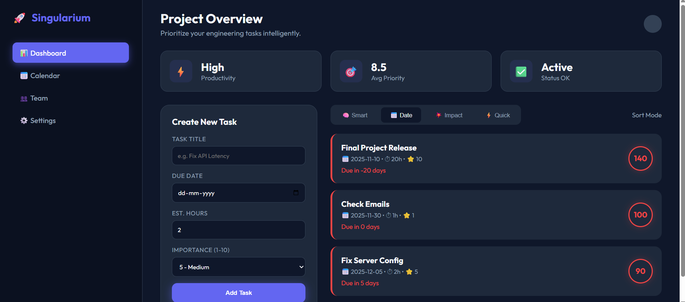
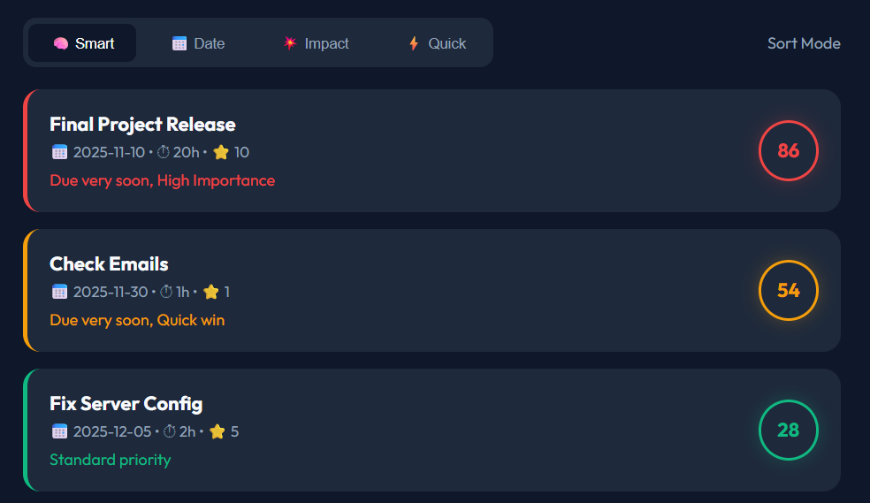
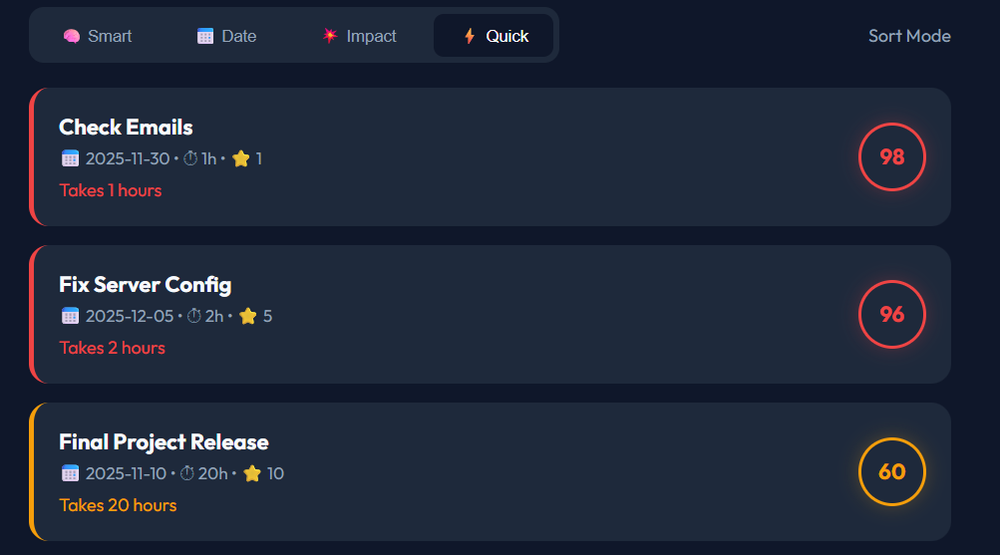
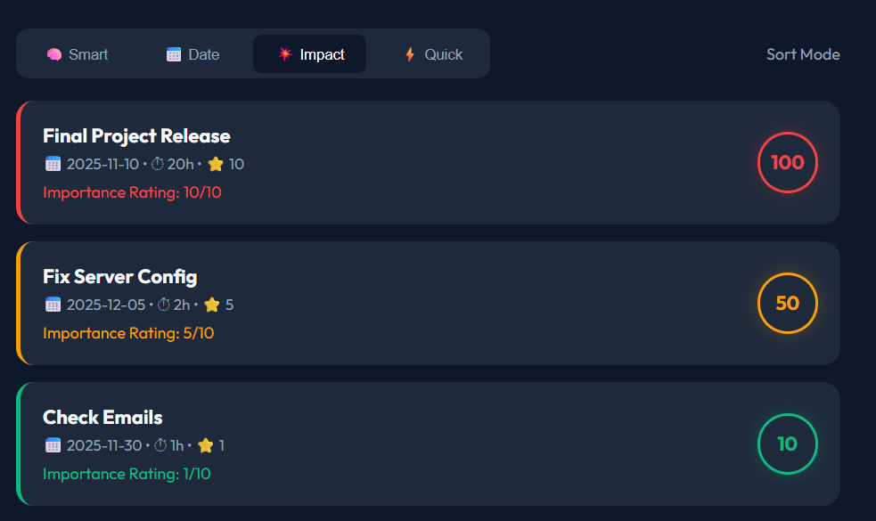
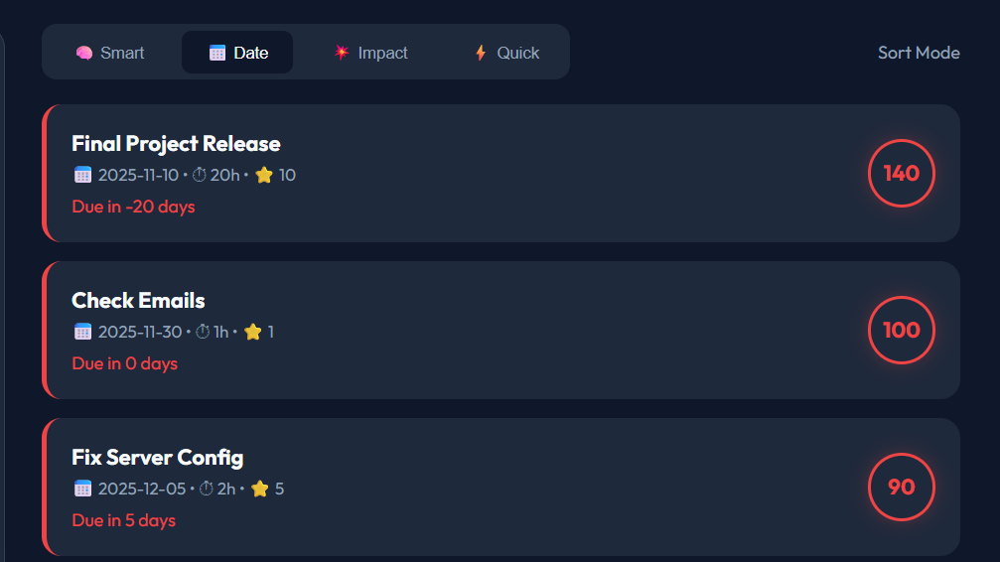

# 🚀 Singularium Smart Task Analyzer

A high-performance task prioritization engine with a **SaaS-style Dark Mode Dashboard**.

This project solves the "Task Paralysis" problem by using a **Weighted Decay Algorithm** to intelligently score and rank tasks. Unlike simple to-do lists, this engine understands **Dependency Graphs**, **Urgency Decay**, and **Opportunity Costs**.

---

## 📸 Features

* **🧠 Smart Scoring Engine:** A heuristic algorithm that calculates a "Priority Score" (0-100) based on 4 vectors.
* **📊 Pro Dashboard UI:** A split-screen, dark-themed interface built for productivity.
* **🕸️ Dependency Gravity:** Tasks that block other important tasks are automatically promoted to the top.
* **📉 Urgency Curves:** Implements exponential decay for deadlines (tasks due tomorrow are 10x more urgent than tasks due next week).

---

## 🛠️ Setup Instructions

### Prerequisites
* Python 3.8+
* Pip

### Installation
1.  **Clone the repository**
    ```bash
    git clone <your-repo-link-here>
    cd smart_task_manager
    ```

2.  **Install Dependencies**
    ```bash
    pip install -r requirements.txt
    ```

3.  **Initialize Database**
    ```bash
    python manage.py makemigrations
    python manage.py migrate
    ```

4.  **Run the Application**
    ```bash
    python manage.py runserver
    ```
    * **Dashboard:** Open `frontend/index.html` in your browser.
    * **API:** `http://127.0.0.1:8000/api/tasks/analyze/`

---

## 🧠 Algorithm Explanation (The "Secret Sauce")

The core of this project is the `SmartScoringEngine` class. It avoids linear sorting by using a weighted sum formula:

$$ Score = (U \times W_u) + (I \times W_i) + (E \times W_e) + (D \times W_d) $$

### 1. Urgency (U) - The Decay Function
I avoided linear days-counting. Instead, I used a hyperbolic decay function: `30 / (days + 1)`.
* *Result:* A task due in 24 hours scores exponentially higher than one due in 3 days.
* *Edge Case:* Past-due tasks break the curve and receive a static "Critical" penalty.

### 2. Dependency Gravity (D) - The Graph Logic
This is the unique feature. The engine checks the **Dependency Graph** defined in `models.py`.
* If **Task A** blocks **Task B**, and **Task B** is "High Importance," then **Task A** inherits a "Gravity Bonus."
* This ensures bottlenecks are cleared first, even if the blocking task itself seems trivial.

### 3. Strategic Importance (I) & Effort (E)
* **Importance:** Multiplied by 3.5 to ensure strategic goals always outweigh busy work.
* **Effort:** In "Quick Wins" mode, tasks under 2 hours receive a micro-bonus to encourage momentum.

---

## 🏗️ Design Decisions

* **Separation of Concerns:** The scoring logic is isolated in `tasks/engine.py`, keeping the Views clean and testable.
* **Frontend Architecture:** Built with pure HTML/JS/CSS to ensure zero build-step latency, but styled with CSS Variables to mimic a React/Tailwind workflow.
* **Safety:** The `Task` model includes validation to prevent Circular Dependencies (A waits for B waits for A).

---

## 🧪 Testing
Run the automated unit tests to verify the algorithm:
```bash
python manage.py test tasks
```

---

## 🎨 User Interface

### Homepage - Main Dashboard
The dashboard provides a sleek, dark-themed interface for task management with real-time prioritization.



### Smart Strategy Selection
Switch between different prioritization strategies to match your workflow:



### Quick Session Management
Quick wins feature for fast task completion tracking:



### Impact Analysis
Visual breakdown of task impact on your workflow:



### Date-Based Sorting
Organize tasks by deadline with intelligent date handling:



---